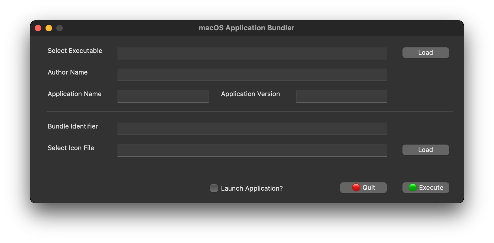
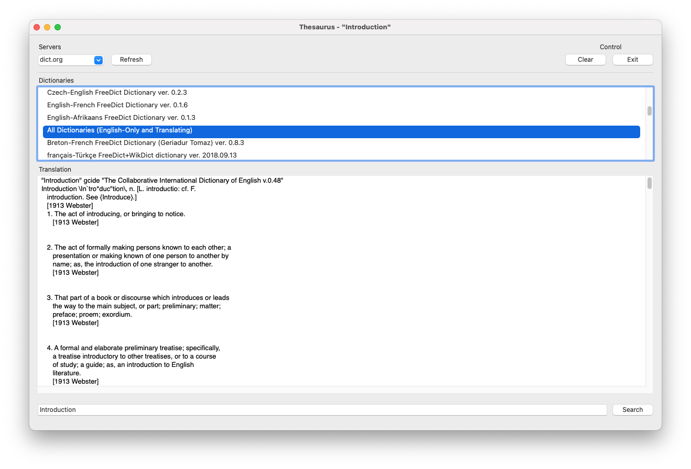

# NimCocoa

NimCocoa is an experimental implementation of a ***Native*** GUI for the Nim programming language running on macOS.

Rather than rely on low level calls to objc_msgsend and it's variants, it uses actual Objective-C code modules I created that are wrapped using C-Style functions, which Nim can then use.

At the moment, the following GUI objects are available:

- NSWindow

- NSButton

- NSCombobox

- NSLabel

- NSMenu

- NSSavedialog

- NSTextfield

- NSCheckbox

- NSDialog

- NSLine

- NSMessagebox

- NSSlider

- NSListbox

- NSOpendialog

- NSTextedit


Preliminary documentation for [GUI objects is available](docs/NimCocoa%20GUI%20Objects.md) 


Here is an example of what coding with NimCocoa looks like:

```nim
import Cocoa / [NSWindow, NSTextfield, NSLabel, NSCheckbox, NSButton, NSLine, NSOpendialog, NSFunctions]
import json, os, plists, times

var mainWin: ID

var lblFile, txtFile, btnFile, lblAuthor, txtAuthor, lblApp, 
    txtApp, lblImage, txtImage, btnImage, line1, lblVersion, 
    txtVersion, lblIdent, txtIdent, line2, chkLaunch, btnExec: ID

const
  width:cint = 800
  height:cint = 310
  winStyle = NSWindowStyleMaskTitled or NSWindowStyleMaskClosable or NSWindowStyleMaskMiniaturizable


proc main() =

  Cocoa_Init()

  mainWin = newWindow("macOS Application Bundler", width, height, winStyle)

  lblFile = newLabel(mainWin, "Select Executable",30, 20, 120, 25)
  txtFile = newTextField(mainWin, "", 160, 20, 500, 25)
  btnFile = newButton(mainWin, "Load", 680, 20, 100, 25, getExecutable)
  txtFile.anchor=akWidth; btnFile.anchor=akRight

  lblAuthor = newLabel(mainWin, "Author Name", 30, 60, 120, 25)
  txtAuthor = newTextField(mainWin, "", 160, 60, 500, 25)
  txtAuthor.anchor=akWidth

  lblApp = newLabel(mainWin, "Application Name", 30, 100, 120, 25)
  txtApp = newTextField(mainWin, "", 160, 100, 170, 25)
  txtApp.anchor=akWidth

  lblImage = newLabel(mainWin, "Select Icon File", 30, 200, 120, 25)
  txtImage = newTextField(mainWin, "", 160, 200, 500, 25)
  btnImage = newButton(mainWin, "Load", 680, 200, 100, 25, getImage)
  txtImage.anchor=akWidth; btnImage.anchor=akRight

  line1 = newSeparator(mainWin, 30, 140, 750)

  lblVersion = newLabel(mainWin, "Application Version", 350, 100, 130, 25)
  txtVersion = newTextField(mainWin, "", 490, 100, 170, 25)
  txtVersion.anchor=akRight; lblVersion.anchor=akRight

  lblIdent = newLabel(mainWin, "Bundle Identifier", 30, 160, 120, 25)
  txtIdent = newTextField(mainWin, "", 160, 160, 500, 25)
  # btnCredits = newButton(mainWin, "Load", 680, 160, 100, 25, nil)
  txtIdent.anchor=akWidth

  line2 = newSeparator(mainWin, 20, 240, 750)

  chkLaunch = newCheckBox(mainWin, "Launch Application?", 320, 270, 150, 25)
  btnExec = newButton(mainWin, "Execute", 680, 270, 100, 25, createAppBundle)
  chkLaunch.anchor=akLeft + akRight + akBottom; btnExec.anchor=akRight + akBottom

  Cocoa_Run(mainWin)

if isMainModule:
  main()
```

Which results in the following:



Another screenshot:


Same app resized, showing how objects flow based on their associated 'anchor' setting:



I am working on documenting the available objects/functions as well as examples.

Stay Tuned!
